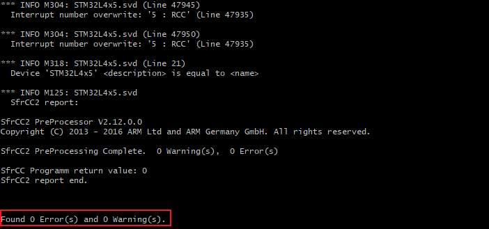
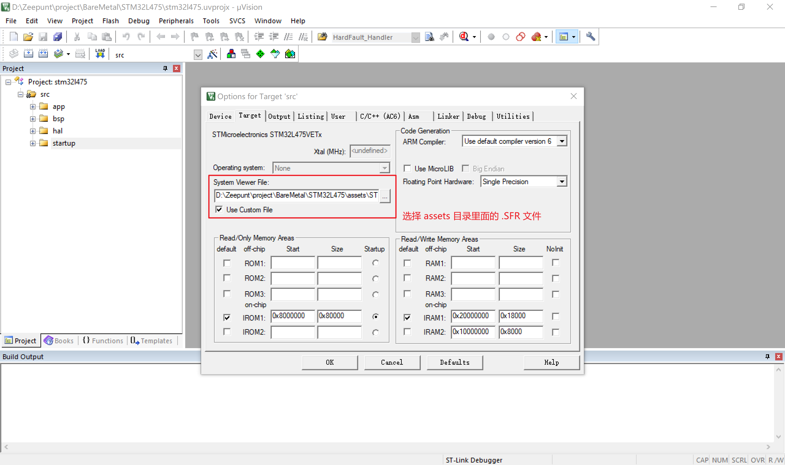

# 依赖版本

- [cmsis-core](https://github.com/STMicroelectronics/cmsis-core)：v5.9.0

- [stm32l4xx_hal_driver](https://github.com/STMicroelectronics/stm32l4xx_hal_driver)：v1.13.5

- stm32l4xx_hal_conf.h：

  参考 stm32l4xx_hal_dirver 里面的 stm32l4xx_hal_conf_template.h。

- startup_stm32l475xx.s 和 system_stm32l4xx.c：

  `Keil.STM32L4xx_DFP.2.7.0.pack` 里面的 `Drivers/CMSIS/Device/ST/STM32L4xx/Source/Templates` 目录提供。

  > 将后缀名 .pack 改为 .zip 就可以用压缩软件直接打开了

- stm32l475xx.h 和 system_stm32l4xx.h：

  `Keil.STM32L4xx_DFP.2.7.0.pack` 里面的 `Drivers/CMSIS/Device/ST/STM32L4xx/Include` 目录提供。

# 调试配置

1. Keil 使用 SVD 生成 SFR

   SVD 文件位于 Keil.STM32L4xx_DFP.2.7.0.pack 的 `CMSIS/SVD` 目录里面。

   MSYS2：

   ```shell
   export PATH=$PATH:"/d/Program Files/Keil_v5/UV4"
   
   SVDConv ./STM32L4x5.svd --generate=sfr
   ```

   执行结果：

   

2. 在 Keil 里面添加 SFR 文件：

   


